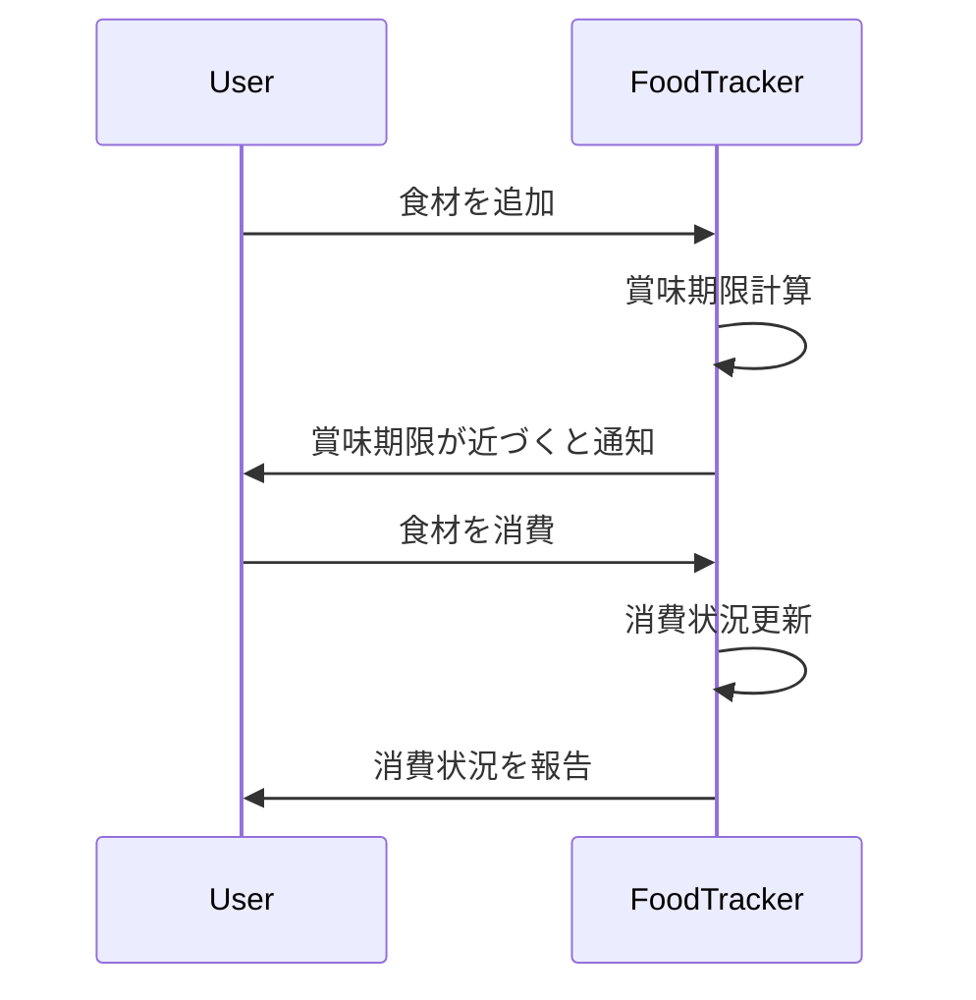

アプリ名: FoodTracker

アプリ概要:
  FoodTrackerは、食材の賞味期限を自動で管理し、無駄を減らすためのアプリです。ユーザーは購入した食材の情報を入力し、アプリが自動で賞味期限を計算し、期限が近づくと通知を送信します。また、自分で買い物リストを作成し、食材の消費状況をチェックすることもできます。

使用技術:
- TypeScript: アプリの主要なプログラミング言語として使用します。
- Python: アプリと連携するスクリプトの実行に使用します。
- Next.js: Reactフレームワークに基づくWebアプリケーションを実装するために使用します。
- Azure: クラウドリソースのホスティングとデータベース管理に使用します。
- GitHub: バージョン管理とコードの共有に使用します。

シーケンス図:

使用技術のインストール方法:
1. TypeScript: https://www.typescriptlang.org/download
2. Python: https://www.python.org/downloads/
3. Next.js: `npm install --save next react react-dom`
4. Azure: アカウントを作成し、Azure Portalから必要なサービスをデプロイします。
5. GitHub: アカウントを作成し、リポジトリを作成します。

アプリの使い方:
1. ログインまたは新規登録を行います。
2. ダッシュボードから食材の追加をします。
3. アプリが自動で賞味期限を計算し、期限が近づくと通知を送信します。
4. 食材を消費すると、消費状況が更新されます。
5. ユーザーは消費状況を報告し、無駄を減らすための改善点を考えます。
